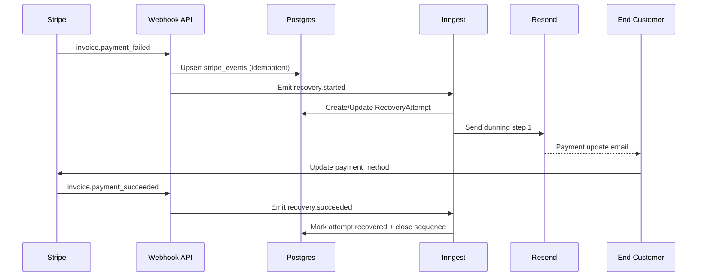

# Dunning Engine Specification

- Owner: Founding Engineer
- Status: Draft v1
- Last Reviewed: 2026-02-17
- Linked ADRs: [ADR-0003](../adr/ADR-0003-job-orchestration.md), [ADR-0002](../adr/ADR-0002-multi-tenant-model.md)
- Linked API References: [OpenAPI v1](../api/openapi.yaml), [Webhook Contracts](../api/webhook-contracts.md), [Error Model](../api/error-model.md)

## Engine Responsibilities
1. Detect and track at-risk subscriptions.
2. Classify decline type (`soft` or `hard`).
3. Execute sequence steps on schedule.
4. Stop sequence on successful recovery.
5. Write audit records for every state transition.

## Decline Classification Rules
1. Soft decline examples: temporary insufficient funds, processing issue.
2. Hard decline examples: stolen card, expired and invalid payment source, invalid account.
3. Unknown code defaults to soft with conservative retry cap.

## Default Sequence (MVP)
1. Step 1: immediately after failure.
2. Step 2: +72 hours.
3. Step 3: +168 hours.
4. Max 5 steps for Pro and above, configurable per workspace.

## Smart Retry Guardrails
1. Retry only for soft declines.
2. Do not retry hard declines automatically.
3. Stop retries when invoice is paid or subscription canceled.

## Critical Flow

## Failure Modes
1. Email provider timeout -> retry send with capped attempts.
2. Webhook duplicate -> idempotent no-op.
3. Missing workspace mapping -> quarantine event and alert.
4. Sequence step send failure -> status `failed`, Sentry alert, operator runbook entry.

## Acceptance Criteria
1. Engine behavior for soft/hard declines is deterministic and documented.
2. All step transitions map to `DunningStepStatus`.
3. Recovery attempt terminal states map to `RecoveryStatus`.

## Non-Goals
1. ML-based send-time optimization in MVP.
2. Multi-channel dunning (SMS, push) in MVP.
