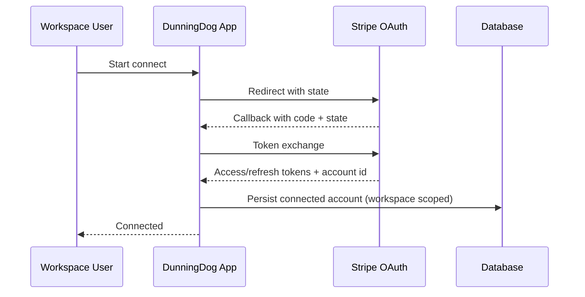

# Stripe Integration Architecture

- Owner: Founding Engineer
- Status: Draft v1
- Last Reviewed: 2026-02-17
- Linked ADRs: [ADR-0001](../adr/ADR-0001-tech-stack.md), [ADR-0002](../adr/ADR-0002-multi-tenant-model.md), [ADR-0003](../adr/ADR-0003-job-orchestration.md)
- Linked API References: [OpenAPI v1](../api/openapi.yaml), [Webhook Contracts](../api/webhook-contracts.md), [Error Model](../api/error-model.md)

## OAuth Connect Flow
1. User triggers `POST /api/stripe/connect/start`.
2. App generates state and redirect URI; user is sent to Stripe OAuth.
3. Stripe redirects to `GET /api/stripe/connect/callback`.
4. App exchanges code for tokens, stores encrypted credentials, links Stripe account to workspace.

## OAuth Sequence

## Webhook Handling
1. Endpoint: `POST /api/webhooks/stripe`.
2. Verify `Stripe-Signature` before processing body.
3. Parse supported event types only.
4. Resolve workspace by `stripe_account_id`.
5. Insert into `stripe_events` with unique `stripe_event_id`.
6. If duplicate event ID, return 200 without side effects.
7. Publish normalized internal event to Inngest.

## Idempotency And Replay
1. External idempotency key: `stripe_event_id`.
2. Internal step idempotency key: `workspace_id:event_type:subject_id:step`.
3. Replay procedure:
   - mark event as replay requested,
   - re-dispatch only if downstream state is not terminal,
   - keep audit record of replay actor and timestamp.

## Supported Event Mapping (MVP)
1. `invoice.payment_failed` -> create/update `RecoveryAttempt`, schedule dunning.
2. `invoice.payment_succeeded` -> mark recovery success, close active sequence.
3. `customer.subscription.updated` -> refresh subscription state and risk flags.
4. `payment_method.automatically_updated` -> clear expiration risk when applicable.

## Security Controls
1. Reject requests with invalid signature.
2. Enforce timestamp tolerance for webhook signature verification.
3. Never log raw token secrets.

## Acceptance Criteria
1. OAuth and webhook flows exactly match endpoint definitions.
2. Duplicate webhook delivery cannot duplicate email sends or retries.
3. Replay behavior is documented and testable.

## Non-Goals
1. Stripe Connect payouts and marketplace features.
2. Stripe multi-account linking per workspace in MVP.
