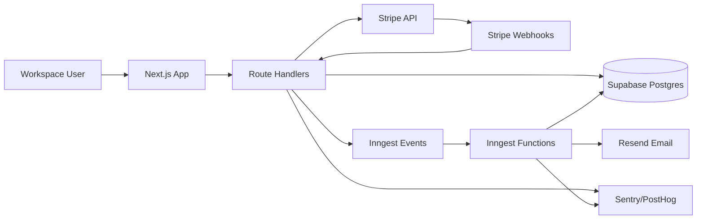

# System Overview

- Owner: Founding Engineer
- Status: Draft v1
- Last Reviewed: 2026-02-17
- Linked ADRs: [ADR-0001](../adr/ADR-0001-tech-stack.md), [ADR-0002](../adr/ADR-0002-multi-tenant-model.md), [ADR-0003](../adr/ADR-0003-job-orchestration.md)
- Linked API References: [OpenAPI v1](../api/openapi.yaml), [Webhook Contracts](../api/webhook-contracts.md), [Error Model](../api/error-model.md)

## Architecture Summary
DunningDog runs as a single Next.js application on Vercel. It handles UI, API route handlers, Stripe OAuth callbacks, webhook ingestion, and event emission to Inngest for background orchestration.

## Core Components
1. `Web App (Next.js + shadcn/ui)`: onboarding, settings, and dashboard.
2. `API Route Handlers`: authentication, Stripe connect, dashboard data, sequence management.
3. `Webhook Ingestion`: signature-verified Stripe event intake.
4. `Workflow Engine (Inngest)`: delayed steps and state transitions for dunning.
5. `Data Layer (Supabase Postgres + Prisma)`: workspace-scoped source of truth.
6. `Email Provider (Resend)`: transactional sends for dunning and pre-dunning.
7. `Observability (Sentry + logs + PostHog)`: runtime quality and behavior analytics.

## High-Level Flow

## Runtime Boundaries
1. UI and API run in Node.js runtime on Vercel.
2. Background logic is asynchronous and idempotent.
3. Every tenant-bound call resolves `workspace_id` first.

## Acceptance Criteria
1. Component boundaries match all architecture and API docs.
2. No feature flow bypasses workspace isolation checks.

## Non-Goals
1. Multi-service decomposition in MVP.
2. Multi-cloud deployment strategy in MVP.
